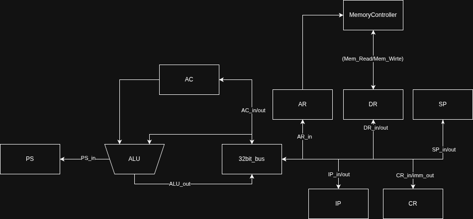
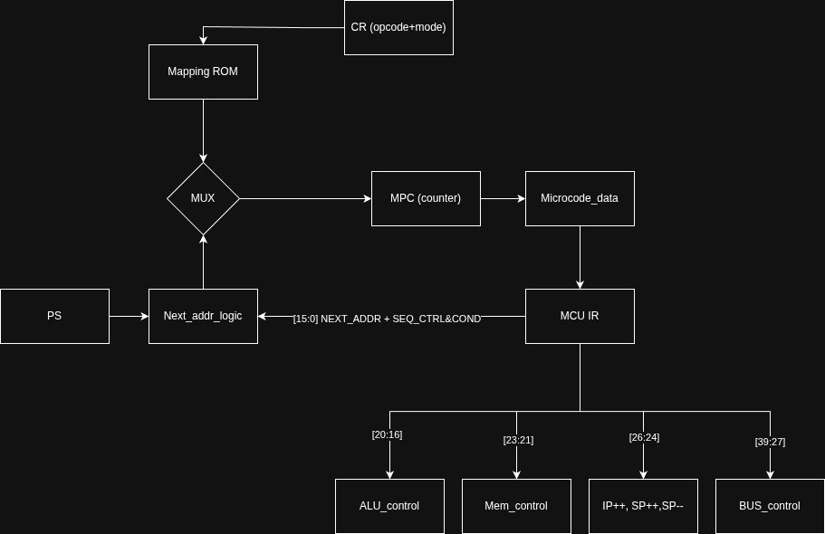
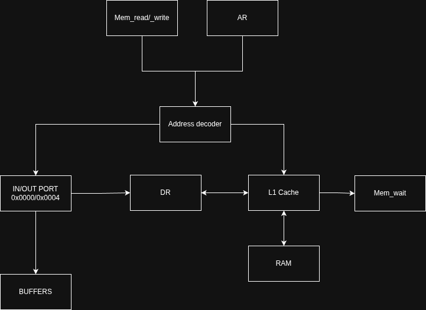

# Лабораторная работа №4. Эксперимент

- **ФИО:** Гузалов Тимур Павлович
- **Группа:** P3232
- **Вариант:** `alg | acc | neum | mc | tick | binary | stream | mem | cstr | prob1 | cache`

## Язык программирования AlcoScript (`alg`)

Язык программирования обладает C-подобным синтаксисом (с элементами Rust), строгой статической типизацией и поддержкой сложных математических выражений.

### Синтаксис (EBNF)

```ebnf
<program>      ::= <declaration>*

<declaration>  ::= <func_decl>

<func_decl>    ::= "fn" <identifier> "(" <param_list> ")" [ "->" <type> ] "{" <statement_list> "}"
<param_list>   ::= [ <param_decl> ("," <param_decl>)* ]
<param_decl>   ::= <type> <identifier>

<statement>    ::= <var_decl> ";"
                 | <assignment> ";"
                 | <if_stmt>
                 | <while_stmt>
                 | <for_stmt>
                 | "return" [ <expression> ] ";"
                 | "cout" ("<<" <expression>)+ ";"
                 | "cin" (">>" <identifier>)+ ";"
                 | <block>

<var_decl>     ::= <type> <identifier> [ "=" <expression> ]
                 | <type> <identifier> "[" <expression> "]"

<type>         ::= "i32" | "ptr"

<block>        ::= "{" <statement_list> "}"

<if_stmt>      ::= "if" <expression> <block> [ "else" <block> ]
<while_stmt>   ::= "while" <expression> <block>
<for_stmt>     ::= "for" "(" <statement> <expression> ";" <expression> ")" <block>

<expression>   ::= <assignment_expr>
<assignment_expr> ::= <logical_or_expr> ( "=" <assignment_expr> )*
<logical_or_expr>  ::= <logical_and_expr> ( "||" <logical_and_expr> )*
<logical_and_expr> ::= <bitwise_or_expr> ( "&&" <bitwise_or_expr> )*
<bitwise_or_expr>  ::= <bitwise_xor_expr> ( "|" <bitwise_xor_expr> )*
<bitwise_xor_expr> ::= <bitwise_and_expr> ( "^" <bitwise_and_expr> )*
<bitwise_and_expr> ::= <equality_expr> ( "&" <equality_expr> )*
<equality_expr>    ::= <relational_expr> ( ("==" | "!=") <relational_expr> )*
<relational_expr>  ::= <additive_expr> ( ("<" | "<=" | ">" | ">=") <additive_expr> )*
<additive_expr>    ::= <multiplicative_expr> ( ("+" | "-") <multiplicative_expr> )*
<multiplicative_expr> ::= <unary_expr> ( ("*" | "/" | "%") <unary_expr> )*

<unary_expr>   ::= "-" <unary_expr> | "!" <unary_expr> | <postfix_expr>
<postfix_expr> ::= <primary> ( "[" <expression> "]" | "(" <arg_list> ")" | "++" | "--" )*

<primary>      ::= <int_literal> | <char_literal> | <string_literal> | <bool_literal>
                 | <identifier> | "|" <expression> "|" | "(" <expression> ")" | "[" <array_elements> "]"

<identifier>   ::= [a-zA-Z_] [a-zA-Z0-9_]*
<int_literal>  ::= <decimal> | "0x" <hex> | "0b" <binary>
<char_literal> ::= "'" <char> "'" 
<string_literal> ::= '"' <string> '"'
<bool_literal> ::= "true" | "false"
```

### Семантика
- **Стратегия вычислений:** Выражения вычисляются слева направо с учетом приоритета операторов.
- **Области видимости:** Лексическая. Функции видны глобально. Переменные локальны в пределах блока `{}`.
- **Типизация:** Строгая статическая. Доступны типы `i32` (32-битное целое) и `ptr` (указатель/массив).
- **Передача аргументов:** Call-by-value.
- **Массивы и строки:** Строки хранятся как нуль-терминированные последовательности 32-битных слов (`cstr`).

## Организация памяти (`neum`)

Архитектура процессора — **фон Неймановская** (единое адресное пространство для команд и данных). 
Размер машинного слова — 32 бита. Адресация байтовая (каждый адрес указывает на отдельный байт; 32-битное слово занимает 4 последовательных байтовых адреса).

**Карта памяти:**
- `0x0000` — `IN_PORT` (MMIO для ввода из потока)
- `0x0004` — `OUT_PORT` (MMIO для вывода в поток)
- `0x0008` — начало секции кода (`CODE_BASE`). Исполнение начинается отсюда.
- Дальше линейно располагаются:
  1. Машинный код (инструкции).
  2. Секция `.data` (строки, инициализированные массивы).
  3. Секция `.bss` (глобальные и локальные переменные, так как рекурсия не поддерживается, компилятор выделяет адреса статически).

**Работа с памятью:**
Память обёрнута в **L1 Кэш** (Direct-mapped, 128 строк по 64 байта, 16 слов). Попадание в кэш занимает 1 такт, промах — 10 тактов (ожидание RAM).

**Размещение литералов, переменных и инструкций:**
- Литералы-константы (целые, символы, булевы) используются через непосредственную адресацию (`LD #value`) — значение встраивается в инструкцию.
- Строковые литералы размещаются в секции данных как null-terminated последовательности 32-битных слов (C-string). Адрес строки передаётся через фиксап в инструкцию загрузки (`LD #addr`).
- Переменные отображаются на статическую память (BSS). Каждая переменная занимает 1 слово (4 байта). Если регистров недостаточно, используются временные переменные в BSS.
- Инструкции располагаются линейно, начиная с адреса 0x0008. Размер каждой инструкции — 4 байта (одно машинное слово). IP инкрементируется на 4.
- Процедуры (функции) размещаются в коде. Вызов — через `CALL` (сохраняет IP в стек), возврат — через `RET`.
- Прерывания не поддерживаются (нет в варианте).
- Сложные выражения компилируются в последовательность инструкций, где каждое подвыражение вычисляется в аккумуляторе (AC). Промежуточные результаты сохраняются во временные переменные в BSS.

## Система команд (`acc` + `mem`)

Процессор построен вокруг **Аккумулятора (AC)**. Большинство арифметических операций использует AC как левый операнд (и место назначения), а значение из шины данных как правый операнд.

### Формат инструкции (32 бита)
```text
[31:24] - Opcode (8 бит)
[23:21] - Mode   (3 бита)
[20:0]  - Address/Operand (21 бит)
```

### Режимы адресации
| Код | Название | Описание |
|---|---|---|
| `000` | Безадресный | Операнд игнорируется (например, `HLT`, `INC`) |
| `001` | Непосредственный | Операнд — 21-битное значение со знаком (`#val`) |
| `010` | Прямой | Операнд — адрес в памяти (`[addr]`) |
| `011` | Косвенный по стеку | Адрес = `SP + ofs` |
| `100` | Автоинкрементный | Чтение по адресу `addr`, затем `addr++` |
| `101` | Автодекрементный | `addr--`, затем чтение по адресу |

### Набор инструкций

Флаги: **Z** — Zero, **N** — Negative, **C** — Carry, **V** — Overflow. `✕` — флаг не меняется, `✓` — обновляется.

Моды адресации: `―` — безадресная, `imm` — непосредственная, `dir` — прямая, `ainc` — автоинкрементная, `adec` — автодекрементная.

#### Управление и системные

| Мнемоника | Опкод | Описание | Моды | Z | N | C | V |
|-----------|-------|----------|------|---|---|---|---|
| `NOP` | `0x00` | Нет операции | ― | ✕ | ✕ | ✕ | ✕ |
| `HLT` | `0x01` | Останов процессора | ― | ✕ | ✕ | ✕ | ✕ |
| `CALL` | `0x39` | Вызов подпрограммы (SP-=4, push IP, IP = CR.operand) | ― | ✕ | ✕ | ✕ | ✕ |
| `RET` | `0x0A` | Возврат (pop IP) | ― | ✕ | ✕ | ✕ | ✕ |

#### Загрузка и сохранение

| Мнемоника | Опкод | Описание | Моды | Z | N | C | V |
|-----------|-------|----------|------|---|---|---|---|
| `LD` | `0x10` | AC = операнд | imm, dir, ainc, adec | ✕ | ✕ | ✕ | ✕ |
| `ST` | `0x11` | Память[операнд] = AC | dir, ainc, adec | ✕ | ✕ | ✕ | ✕ |
| `PUSH` | `0x08` | SP -= 4; push AC на стек | ― | ✕ | ✕ | ✕ | ✕ |
| `POP` | `0x09` | Pop со стека в AC | ― | ✕ | ✕ | ✕ | ✕ |

#### Арифметика и логика (AC ← AC op bus)

| Мнемоника | Опкод | Описание | Моды | Z | N | C | V |
|-----------|-------|----------|------|---|---|---|---|
| `CLA` | `0x02` | AC = 0 (AC - AC) | ― | ✓ | ✓ | ✓ | ✓ |
| `CMA` | `0x03` | AC = ~AC (INV → DEC) | ― | ✓ | ✓ | ✓ | ✓ |
| `INV` | `0x04` | AC = -AC (доп. код) | ― | ✓ | ✓ | ✓ | ✓ |
| `INC` | `0x05` | AC = AC + 1 | ― | ✓ | ✓ | ✓ | ✓ |
| `DEC` | `0x06` | AC = AC - 1 | ― | ✓ | ✓ | ✓ | ✓ |
| `ABS` | `0x07` | AC = |AC| | ― | ✓ | ✓ | ✕ | ✓ |
| `EXT8` | `0x0B` | Знаковое расширение младшего байта | ― | ✓ | ✓ | ✕ | ✕ |
| `EXT16` | `0x0C` | Знаковое расширение младшего полуслова | ― | ✓ | ✓ | ✕ | ✕ |
| `ADD` | `0x20` | AC = AC + операнд | imm, dir | ✓ | ✓ | ✓ | ✓ |
| `ADC` | `0x21` | AC = AC + операнд + C | imm, dir | ✓ | ✓ | ✓ | ✓ |
| `SUB` | `0x22` | AC = AC - операнд | imm, dir | ✓ | ✓ | ✓ | ✓ |
| `MUL` | `0x23` | AC = AC × операнд | imm, dir | ✓ | ✓ | ✕ | ✕ |
| `DIV` | `0x24` | AC = AC ÷ операнд (0 → 0) | imm, dir | ✓ | ✓ | ✕ | ✕ |
| `MOD` | `0x25` | AC = AC % операнд (0 → 0) | imm, dir | ✓ | ✓ | ✕ | ✕ |
| `CMP` | `0x26` | AC - операнд (только флаги) | imm, dir | ✓ | ✓ | ✓ | ✓ |
| `AND` | `0x27` | AC = AC & операнд | imm, dir | ✓ | ✓ | ✕ | ✕ |
| `OR` | `0x28` | AC = AC \| операнд | imm, dir | ✓ | ✓ | ✕ | ✕ |
| `XOR` | `0x29` | AC = AC ^ операнд | imm, dir | ✓ | ✓ | ✕ | ✕ |

#### Ветвления

| Мнемоника | Опкод | Условие | Описание | Моды |
|-----------|-------|---------|----------|------|
| `JMP` | `0x30` | всегда | IP = CR.operand | ― |
| `JEQ` | `0x31` | Z = 1 | Jump if equal / zero | ― |
| `JNE` | `0x32` | Z = 0 | Jump if not equal | ― |
| `JLT` | `0x33` | N = 1 | Jump if less than (signed) | ― |
| `JGE` | `0x34` | N = 0 | Jump if greater or equal | ― |
| `JCS` | `0x35` | C = 1 | Jump if carry set | ― |
| `JCC` | `0x36` | C = 0 | Jump if carry clear | ― |
| `JVS` | `0x37` | V = 1 | Jump if overflow set | ― |
| `JVC` | `0x38` | V = 0 | Jump if overflow clear | ― |

**Примечание:** Кодирование инструкций ветвления не использует поле Mode — адрес перехода всегда 21-битное значение в поле Operand.

## Транслятор

Компилятор реализован на Rust и состоит из следующих этапов:
1. **Лексический анализ**: Превращает исходный код в поток токенов.
2. **Синтаксический анализ**: Строит AST с учётом приоритетов операций.
3. **Базовая оптимизация**: Рекурсивная свертка констант.
4. **Генерация кода**: Двухпроходный компилятор. Собирает символы (адреса переменных, меток, строк), затем генерирует инструкции, применяя фиксапы для ссылок вперед.

**Интерфейс CLI:**
```bash
cargo run --bin compiler <input.algo> <output.bin> [--listing listing.txt]
```
Выходом является плоский бинарный файл (`.bin`) c 32-битными словами.

## Модель процессора (`mc`, `tick`)

Симулятор `psim` работает точно по тактам и реализует микропрограммное управление.

### Тракт данных (DataPath)


### Устройство управления (Control Unit)


Управление осуществляется 40-битными микрокомандами, которые хранятся в массиве  собственной памяти. 
Для каждой инструкции машинного кода существует `mapping`, который транслирует опкод в стартовый адрес микропрограммы.

**Формат микрокоманды (40 бит `u64`):**
- `[39:34]` **OUT**: Кто пишет на шину (`AC`, `DR`, `IP`, `SP`, `CR`, `ALU`).
- `[33:27]` **IN**: Кто читает с шины (`AC`, `DR`, `AR`, `IP`, `SP`, `CR`, `PS`).
- `[26:24]` **CNT**: Инкременты/декременты регистров (`IP++`, `SP++`, `SP--`).
- `[23:21]` **MEM**: Работа с памятью (`Read`, `Write`, `Wait`). Сигнал `Wait` замораживает MPC до готовности кэша.
- `[20:16]` **ALU**: Операция АЛУ (ADD, SUB, MUL и т.д.). Левый операнд — всегда AC, правый — шина.
- `[15:14]` **SEQ**: Управление секвенсором (`NEXT`, `JUMP`, `MAP`).
- `[13:10]` **COND**: Условие перехода (по флагам PS или режимам адресации).
- `[9:0]` **ADDR**: Адрес следующей микрокоманды.

### Подсистема памяти и Кэш


При чтении выставляются сигналы `Mem_Read` и `Mem_Wait`. Кэш-контроллер разбивает байтовый адрес на:
- `Tag` (19 бит), `Index` (7 бит, 128 строк), `Offset` (6 бит, 64 байта на строку).
Номер слова внутри строки: `offset >> 2` (4 байта на слово).
Если происходит `Cache Hit`, данные отдаются за 1 такт. Если `Cache Miss`, процессор простаивает 10 тактов, пока кэш-линия загружается из RAM.

## Тестирование

Тестирование осуществляется скриптом `tests/golden/test_runner.sh`, который компилирует `.algo` файлы, запускает симулятор и сверяет результат и логи тактов с эталонными.

| Алгоритм | Описание |
|---|---|
| `hello` | Печать строки "Hello, World!" |
| `cat` | Эхо-вывод ввода до исчерпания потока |
| `hello_user_name` | Запрос имени через `cin`, вывод приветствия |
| `sort` | Сортировка пузырьком массива |
| `double_precision`| Демонстрация эмуляции 64-битной арифметики (сложение с переносом `ADC`) |
| `cache_demo` | Демонстрация влияния кэша: последовательный доступ к массиву 512 элементов с отслеживанием промахов/попаданий в журнале |
